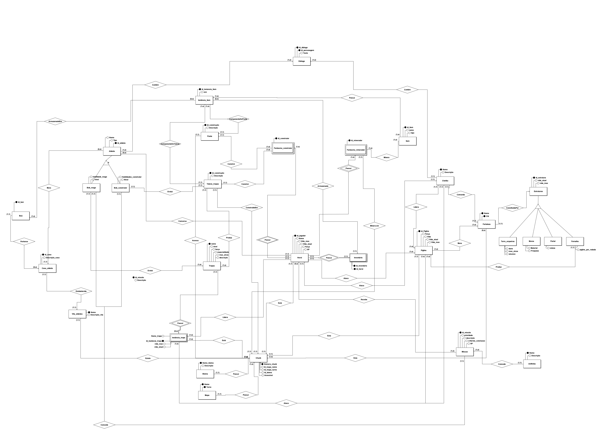
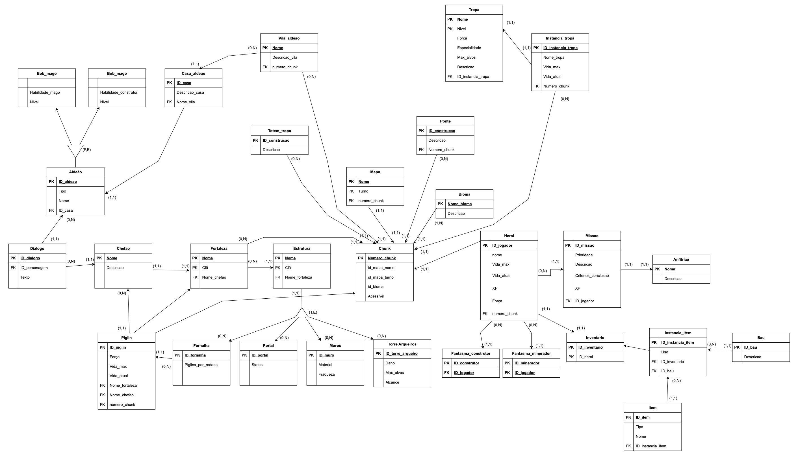

.. _modulo-1:

Módulo 1
=================

Assista aos vídeos explicativos do Módulo 1 para aprofundar seus conhecimentos:

* `Link para o primeiro vídeo do Módulo 1 <https://www.youtube.com/embed/RdbeW6n8fk0>`_
* `Link para o segundo vídeo do Módulo 1 <https://www.youtube.com/watch?v=jHNbsm4IbuQ>`_

.. _diagrama-entidade-relacionamento-der:

Diagrama Entidade-Relacionamento (DER)
======================================

Este documento detalha o **Diagrama Entidade-Relacionamento (DER)**, uma ferramenta essencial para a modelagem e compreensão da estrutura de bancos de dados.

Introdução
----------

O **Diagrama Entidade-Relacionamento (DER)** é uma representação gráfica utilizada para modelar a estrutura lógica de bancos de dados, permitindo visualizar como os dados se organizam e se conectam. Por meio de **entidades**, que representam elementos do mundo real como pessoas, objetos ou conceitos, e de **atributos**, que descrevem as propriedades dessas entidades, o DER torna-se essencial para o planejamento e entendimento de sistemas de informação.

Além disso, os **relacionamentos** entre as entidades são representados por linhas e símbolos que indicam como os dados se associam entre si, evidenciando **cardinalidades**, como "um para muitos" ou "muitos para muitos". Com isso, é possível compreender de forma clara as dependências e conexões entre os elementos do banco de dados, favorecendo tanto a criação quanto a manutenção de estruturas coerentes e funcionais.

Diagrama
--------

###########

Modelo Relacional

###########

O modelo relacional organiza os dados em **tabelas** (relações) compostas por linhas e colunas, onde cada coluna representa um **atributo** e cada linha representa um **registro**. A estrutura é baseada em **chaves primárias (PK)** para identificar registros de forma única e **chaves estrangeiras (FK)** para conectar diferentes tabelas, garantindo a **integridade dos dados**.

Além disso, o modelo permite a manipulação eficiente das informações por meio da linguagem **SQL**, facilitando consultas, inserções e atualizações. Sua flexibilidade e clareza na estruturação fazem com que seja amplamente utilizado em sistemas de banco de dados, promovendo a organização, consistência e escalabilidade das informações armazenadas.

Modelo Relacional
-----------------

.. _dicionario-de-dados:

Dicionário de Dados Completo
============================

[cite_start]Este dicionário detalha a estrutura do banco de dados, incluindo todas as tabelas, seus atributos, tipos de dados, chaves e descrições baseadas no diagrama relacional. [cite: 2]

[cite_start]Tabelas de Personagens e Entidades Vivas [cite: 3]
****************************************

[cite_start]Tabela: Heroi [cite: 4]
-----------------
[cite_start]Armazena os dados principais do jogador/herói. [cite: 5]

+----------------+-----------------+-------------------------+-----------------------------------------+-----------------------------------+
| Nome do Campo  | Chave/Restrição | Tipo de Dado (Sugerido) | Descrição                               | Observações                       |
+================+=================+=========================+=========================================+===================================+
| ``ID_jogador`` | PK              | INTEGER                 | Identificador único para cada herói.    | Chave Primária.                   |
+----------------+-----------------+-------------------------+-----------------------------------------+-----------------------------------+
| ``nome``       |                 | VARCHAR(100)            | Nome do herói.                          |                                   |
+----------------+-----------------+-------------------------+-----------------------------------------+-----------------------------------+
| ``vida_max``   |                 | INTEGER                 | Pontos de vida máximos do herói.        |                                   |
+----------------+-----------------+-------------------------+-----------------------------------------+-----------------------------------+
| ``vida_atual`` |                 | INTEGER                 | Pontos de vida atuais do herói.         |                                   |
+----------------+-----------------+-------------------------+-----------------------------------------+-----------------------------------+
| ``XP``         |                 | INTEGER                 | Pontos de experiência do herói.         |                                   |
+----------------+-----------------+-------------------------+-----------------------------------------+-----------------------------------+
| ``forca``      |                 | INTEGER                 | Atributo de força do herói.             |                                   |
+----------------+-----------------+-------------------------+-----------------------------------------+-----------------------------------+
| ``numero_chunk``| FK              | INTEGER                 | Identificador do chunk onde o herói se  | Refere-se a ``Chunk.Numero_chunk``|
|                |                 |                         | encontra.                               |                                   |
+----------------+-----------------+-------------------------+-----------------------------------------+-----------------------------------+

[cite_start]Tabela: Aldeao [cite: 21]
------------------
[cite_start]Armazena dados sobre os personagens aldeões (NPCs). [cite: 22]

+---------------+-----------------+-------------------------+----------------------------------+-----------------------------------+
| Nome do Campo | Chave/Restrição | Tipo de Dado (Sugerido) | Descrição                        | Observações                       |
+===============+=================+=========================+==================================+===================================+
| ``ID_aldeao`` | PK              | INTEGER                 | Identificador único do aldeão.   | Chave Primária                    |
+---------------+-----------------+-------------------------+----------------------------------+-----------------------------------+
| ``Nome``      |                 | VARCHAR(100)            | Nome do aldeão.                  |                                   |
+---------------+-----------------+-------------------------+----------------------------------+-----------------------------------+
| ``Tipo``      |                 | VARCHAR(50)             | Tipo ou profissão do aldeão.     |                                   |
+---------------+-----------------+-------------------------+----------------------------------+-----------------------------------+
| ``ID_casa``   | FK              | INTEGER                 | Casa onde o aldeão vive.         | Refere-se a ``Casa_aldeao.ID_casa`` |
+---------------+-----------------+-------------------------+----------------------------------+-----------------------------------+

[cite_start]Tabela: Chefao [cite: 24]
------------------
[cite_start]Informações sobre os chefões (Bosses) do jogo. [cite: 25]

+---------------+-----------------+-------------------------+------------------------------------------+-------------------+
| Nome do Campo | Chave/Restrição | Tipo de Dado (Sugerido) | Descrição                                | Observações       |
+===============+=================+=========================+==========================================+===================+
| ``Nome``      | PK              | VARCHAR(100)            | Nome e identificador único do chefão.    | Chave Primária.   |
+---------------+-----------------+-------------------------+------------------------------------------+-------------------+
| ``Descricao`` |                 | TEXT                    | Descrição e lore do chefão.              |                   |
+---------------+-----------------+-------------------------+------------------------------------------+-------------------+

[cite_start]Tabela: Tropa [cite: 27]
-----------------
[cite_start]Define os arquétipos de tropas que podem existir no jogo. [cite: 28]

+------------------------+-----------------+-------------------------+------------------------------------------------------+----------------------------------------------+
| Nome do Campo          | Chave/Restrição | Tipo de Dado (Sugerido) | Descrição                                            | Observações                                  |
+========================+=================+=========================+======================================================+==============================================+
| ``Nome``               | PK              | VARCHAR(100)            | Nome e identificador único do tipo de tropa.         | Chave Primária.                              |
+------------------------+-----------------+-------------------------+------------------------------------------------------+----------------------------------------------+
| ``Forca``              |                 | INTEGER                 | Atributo de força base da tropa.                     |                                              |
+------------------------+-----------------+-------------------------+------------------------------------------------------+----------------------------------------------+
| ``Especialidade``      |                 | VARCHAR(100)            | Habilidade ou característica especial da tropa.      |                                              |
+------------------------+-----------------+-------------------------+------------------------------------------------------+----------------------------------------------+
| ``Max_alvos``          |                 | INTEGER                 | Número máximo de alvos que a tropa pode atingir.     |                                              |
+------------------------+-----------------+-------------------------+------------------------------------------------------+----------------------------------------------+
| ``Vida_max``           |                 | INTEGER                 | Pontos de vida máximos padrão para este tipo de tropa.|                                              |
+------------------------+-----------------+-------------------------+------------------------------------------------------+----------------------------------------------+
| ``Descricao``          |                 | TEXT                    | Descrição da tropa.                                  |                                              |
+------------------------+-----------------+-------------------------+------------------------------------------------------+----------------------------------------------+
| ``ID_instancia_tropa`` | FK              | INTEGER                 | Chave estrangeira para a tabela de instâncias.       | Refere-se a ``Instancia_tropa.ID_instancia_tropa`` |
+------------------------+-----------------+-------------------------+------------------------------------------------------+----------------------------------------------+

[cite_start]Tabela: Instancia_tropa [cite: 31]
---------------------------
[cite_start]Representa uma unidade ou grupo específico de uma tropa no mapa. [cite: 32]

+------------------------+-----------------+-------------------------+---------------------------------------------+------------------------------------+
| Nome do Campo          | Chave/Restrição | Tipo de Dado (Sugerido) | Descrição                                   | Observações                        |
+========================+=================+=========================+=============================================+====================================+
| ``ID_instancia_tropa`` | PK              | INTEGER                 | Identificador único da instância da tropa.  | Chave Primária.                    |
+------------------------+-----------------+-------------------------+---------------------------------------------+====================================+
| ``Nome_tropa``         | FK              | VARCHAR(100)            | Nome do tipo de tropa.                      | Refere-se a ``Tropa.Nome``.        |
+------------------------+-----------------+-------------------------+---------------------------------------------+------------------------------------+
| ``Vida_max``           |                 | INTEGER                 | Pontos de vida máximos desta instância.     |                                    |
+------------------------+-----------------+-------------------------+---------------------------------------------+------------------------------------+
| ``Vida_atual``         |                 | INTEGER                 | Pontos de vida atuais desta instância.      |                                    |
+------------------------+-----------------+-------------------------+---------------------------------------------+------------------------------------+
| ``Numero_chunk``       | FK              | INTEGER                 | Chunk onde a instância da tropa está        | Refere-se a ``Chunk.Numero_chunk``. |
|                        |                 |                         | localizada.                                 |                                    |
+------------------------+-----------------+-------------------------+---------------------------------------------+------------------------------------+

[cite_start]Tabela: Piglin [cite: 35]
------------------
[cite_start]Representa um tipo de inimigo ou NPC específico do jogo. [cite: 36]

+-----------------+-----------------+-------------------------+---------------------------------------------+------------------------------------+
| Nome do Campo   | Chave/Restrição | Tipo de Dado (Sugerido) | Descrição                                   | Observações                        |
+=================+=================+=========================+=============================================+====================================+
| ``ID_piglin``   | PK              | INTEGER                 | Identificador único do Piglin.              | Chave Primária.                    |
+-----------------+-----------------+-------------------------+---------------------------------------------+------------------------------------+
| ``Forca``       |                 | INTEGER                 | Atributo de força do Piglin.                |                                    |
+-----------------+-----------------+-------------------------+---------------------------------------------+------------------------------------+
| ``Vida_max``    |                 | INTEGER                 | Pontos de vida máximos do Piglin.           |                                    |
+-----------------+-----------------+-------------------------+---------------------------------------------+------------------------------------+
| ``Vida_atual``  |                 | INTEGER                 | Pontos de vida atuais do Piglin.            |                                    |
+-----------------+-----------------+-------------------------+---------------------------------------------+------------------------------------+
|``Nome_fortaleza``| FK              | VARCHAR(100)            | Fortaleza à qual o Piglin está associado.   | Refere-se a ``Fortaleza.Nome``.    |
+-----------------+-----------------+-------------------------+---------------------------------------------+------------------------------------+
| ``Nome_chefao`` | FK              | VARCHAR(100)            | Chefão que comanda o Piglin.                | Refere-se a ``Chefao.Nome``.       |
+-----------------+-----------------+-------------------------+---------------------------------------------+------------------------------------+
| ``numero_chunk``| FK              | INTEGER                 | Chunk onde o Piglin se encontra.            | Refere-se a ``Chunk.Numero_chunk`` |
+-----------------+-----------------+-------------------------+---------------------------------------------+------------------------------------+

[cite_start]Tabela: Fantasma_construtor e Fantasma_minerador [cite: 39]
------------------------------------------------------
[cite_start]Representam papéis ou habilidades especiais que o jogador pode assumir. [cite: 40]

+-------------------+-----------------+-------------------------+-------------------------------------------+-----------------------------------------------------+
| Nome do Campo     | Chave/Restrição | Tipo de Dado (Sugerido) | Descrição                                 | Observações                                         |
+===================+=================+=========================+===========================================+=====================================================+
| ``ID_construtor`` | PK              | INTEGER                 | Identificador único da entidade construtora.| Chave Primária da tabela ``Fantasma_construtor``.   |
+-------------------+-----------------+-------------------------+-------------------------------------------+-----------------------------------------------------+
| ``ID_minerador``  | PK              | INTEGER                 | Identificador único da entidade mineradora. | Chave Primária da tabela ``Fantasma_minerador``.    |
+-------------------+-----------------+-------------------------+-------------------------------------------+-----------------------------------------------------+
| ``ID_jogador``    | FK              | INTEGER                 | Jogador que assume este papel.            | Refere-se a ``Heroi.ID_jogador``.                   |
+-------------------+-----------------+-------------------------+-------------------------------------------+-----------------------------------------------------+

[cite_start]Tabela: Anfitriao [cite: 42]
-------------------
[cite_start]Provavelmente representa uma entidade que hospeda ou inicia um evento ou missão. [cite: 43]

+---------------+-----------------+-------------------------+------------------------------------------+-------------------+
| Nome do Campo | Chave/Restrição | Tipo de Dado (Sugerido) | Descrição                                | Observações       |
+===============+=================+=========================+==========================================+===================+
| ``Nome``      | PK              | VARCHAR(100)            | Nome e identificador único do anfitrião. | Chave Primária.   |
+---------------+-----------------+-------------------------+------------------------------------------+-------------------+
| ``Descricao`` |                 | TEXT                    | Descrição do papel do anfitrião.         |                   |
+---------------+-----------------+-------------------------+------------------------------------------+-------------------+

[cite_start]Tabelas de Mundo e Ambiente [cite: 45]
***************************

[cite_start]Tabela: Mapa [cite: 46]
----------------
[cite_start]Define os mapas do jogo. [cite: 47]

+----------------+-----------------+-------------------------+------------------------------------------+--------------------------+
| Nome do Campo  | Chave/Restrição | Tipo de Dado (Sugerido) | Descrição                                | Observações              |
+================+=================+=========================+==========================================+==========================+
| ``Nome``       | PK              | VARCHAR(100)            | Nome e identificador do mapa.            | Chave Primária Composta. |
+----------------+-----------------+-------------------------+------------------------------------------+--------------------------+
| ``Tumo``       | PK              | VARCHAR(100)            | Turno ou estado específico do mapa.      | Chave Primária Composta. |
+----------------+-----------------+-------------------------+------------------------------------------+--------------------------+
|``numero_chunk``| FK              | INTEGER                 | Chave estrangeira para a tabela de chunks.| Refere-se a ``Chunk.Numero_chunk``. |
+----------------+-----------------+-------------------------+------------------------------------------+--------------------------+

[cite_start]Tabela: Chunk [cite: 50]
-----------------
[cite_start]Representa uma porção ou área do mapa do jogo. [cite: 51]

+----------------+-----------------+-------------------------+-------------------------------------------+-----------------------------------+
| Nome do Campo  | Chave/Restrição | Tipo de Dado (Sugerido) | Descrição                                 | Observações                       |
+================+=================+=========================+===========================================+===================================+
|``Numero_chunk``| PK              | INTEGER                 | Identificador único para cada chunk.      | Primária.                         |
+----------------+-----------------+-------------------------+-------------------------------------------+-----------------------------------+
|``id_mapa_nome``| FK              | VARCHAR(100)            | Nome do mapa ao qual o chunk pertence.    | Refere-se a ``Mapa.Nome``.        |
+----------------+-----------------+-------------------------+-------------------------------------------+-----------------------------------+
|``id_mapa_tumo``| FK              | VARCHAR(100)            | Turno do mapa ao qual o chunk pertence.   | Refere-se a ``Mapa.Tumo``.        |
+----------------+-----------------+-------------------------+-------------------------------------------+-----------------------------------+
| ``id_bioma``   | FK              | VARCHAR(100)            | Bioma predominante no chunk.              | Refere-se a ``Bioma.Nome_bioma``. |
+----------------+-----------------+-------------------------+-------------------------------------------+-----------------------------------+
| ``Acessivel``  |                 | BOOLEAN                 | Indica se o chunk é acessível ao jogador. |                                   |
+----------------+-----------------+-------------------------+-------------------------------------------+-----------------------------------+

[cite_start]Tabela: Bioma [cite: 58]
-----------------
[cite_start]Armazena os diferentes tipos de biomas do mundo. [cite: 59]

+--------------+-----------------+-------------------------+-----------------------------------------+------------------+
| Nome do Campo| Chave/Restrição | Tipo de Dado (Sugerido) | Descrição                               | Observações      |
+==============+=================+=========================+=========================================+==================+
|``Nome_bioma``| PK              | VARCHAR(100)            | Nome e identificador único do bioma.    | Chave Primária.  |
+--------------+-----------------+-------------------------+-----------------------------------------+------------------+
| ``Descricao``|                 | TEXT                    | Descrição do bioma.                     |                  |
+--------------+-----------------+-------------------------+-----------------------------------------+------------------+

[cite_start]Tabelas de Estruturas e Construções [cite: 61]
***********************************

[cite_start]Tabela: Vila_aldeao [cite: 62]
-----------------------
[cite_start]Armazena informações sobre as vilas de aldeões. [cite: 63]

+------------------+-----------------+-------------------------+------------------------------------------+-----------------------------------+
| Nome do Campo    | Chave/Restrição | Tipo de Dado (Sugerido) | Descrição                                | Observações                       |
+==================+=================+=========================+==========================================+===================================+
| ``Nome``         | PK              | VARCHAR(100)            | Nome e identificador único da vila.      | Chave Primária.                   |
+------------------+-----------------+-------------------------+------------------------------------------+-----------------------------------+
|``Descricao_vila``|                 | TEXT                    | Descrição da vila.                       |                                   |
+------------------+-----------------+-------------------------+------------------------------------------+-----------------------------------+
| ``numero_chunk`` | FK              | INTEGER                 | Chunk onde a vila está localizada.       | Refere-se a ``Chunk.Numero_chunk``|
+------------------+-----------------+-------------------------+------------------------------------------+-----------------------------------+

[cite_start]Tabela: Casa_aldeao [cite: 73]
-----------------------
[cite_start]Representa as casas dentro de uma vila. [cite: 74]

+------------------+-----------------+-------------------------+-----------------------------------+-----------------------------------+
| Nome do Campo    | Chave/Restrição | Tipo de Dado (Sugerido) | Descrição                         | Observações                       |
+==================+=================+=========================+===================================+===================================+
| ``ID_casa``      | PK              | INTEGER                 | Identificador único da casa.      | Chave Primária.                   |
+------------------+-----------------+-------------------------+-----------------------------------+-----------------------------------+
|``Descricao_casa``|                 | TEXT                    | Descrição da casa.                |                                   |
+------------------+-----------------+-------------------------+-----------------------------------+-----------------------------------+
| ``Nome_vila``    | FK              | VARCHAR(100)            | Vila à qual a casa pertence.      | Refere-se a ``Vila_aldeao.Nome``. |
+------------------+-----------------+-------------------------+-----------------------------------+-----------------------------------+

[cite_start]Tabela: Fortaleza [cite: 76]
-------------------
[cite_start]Armazena informações sobre fortalezas. [cite: 77]

+---------------+-----------------+-------------------------+---------------------------------------------+-----------------------------+
| Nome do Campo | Chave/Restrição | Tipo de Dado (Sugerido) | Descrição                                   | Observações                 |
+===============+=================+=========================+=============================================+=============================+
| ``Nome``      | PK              | VARCHAR(100)            | Nome e identificador único da fortaleza.    | Chave Primária Composta.    |
+---------------+-----------------+-------------------------+---------------------------------------------+-----------------------------+
| ``Cla``       | PK              | VARCHAR(100)            | Clã ou facção que controla a fortaleza.     | Chave Primária Composta.    |
+---------------+-----------------+-------------------------+---------------------------------------------+-----------------------------+
| ``Nome_chefao`` | FK            | VARCHAR(100)            | Chefão que comanda a fortaleza.             | Refere-se a ``Chefao.Nome``. |
+---------------+-----------------+-------------------------+---------------------------------------------+-----------------------------+

[cite_start]Tabela: Estrutura [cite: 79]
-------------------
[cite_start]Tabela genérica para diferentes tipos de estruturas construídas no jogo. [cite: 80]

+-------------------+-----------------+-------------------------+--------------------------------------------------+---------------------------------+
| Nome do Campo     | Chave/Restrição | Tipo de Dado (Sugerido) | Descrição                                        | Observações                     |
+===================+=================+=========================+==================================================+=================================+
| ``Nome``          | PK              | VARCHAR(100)            | Nome e identificador da estrutura.               | Chave Primária.                 |
+-------------------+-----------------+-------------------------+--------------------------------------------------+---------------------------------+
| ``Cla``           |                 | VARCHAR(100)            | Clã ou facção proprietária da estrutura.         |                                 |
+-------------------+-----------------+-------------------------+--------------------------------------------------+---------------------------------+
|``Nome_fortaleza`` | FK              | VARCHAR(100)            | Fortaleza à qual a estrutura pode estar associada. | Refere-se a ``Fortaleza.Nome``. |
+-------------------+-----------------+-------------------------+--------------------------------------------------+---------------------------------+

[cite_start]Tabelas de Construções Específicas [cite: 83]
----------------------------------
[cite_start]Estas tabelas herdam ou se relacionam com a tabela Estrutura. [cite: 84]

* [cite_start]**Muros** [cite: 86]
    * [cite_start]``ID_muro`` (PK): Identificador do muro. [cite: 87]
    * [cite_start]``Material``: Material de que o muro é feito. [cite: 88]
    * [cite_start]``Fraqueza``: Fraqueza do muro. [cite: 89]

* [cite_start]**Torre_Arqueira** [cite: 90]
    * [cite_start]``ID_torre_arqueiro`` (PK): Identificador da torre. [cite: 91]
    * [cite_start]``Dano``: Dano causado pela torre. [cite: 93]
    * [cite_start]``Max_alvos``: Número máximo de alvos. [cite: 95]
    * [cite_start]``Alcance``: Alcance dos ataques. [cite: 94]

* [cite_start]**Ponte** [cite: 96]
    * [cite_start]``ID_construcao`` (PK): Identificador da ponte. [cite: 97]
    * [cite_start]``Descricao``: Descrição da ponte. [cite: 97]
    * [cite_start]``Numero_chunk`` (FK): Chunk onde se localiza. [cite: 98]

* [cite_start]**Totem_tropa** [cite: 99]
    * [cite_start]``ID_construcao`` (PK): Identificador do totem. [cite: 100]
    * [cite_start]``Descricao``: Descrição do totem. [cite: 100]

* [cite_start]**Fornalha** [cite: 101]
    * [cite_start]``ID_fornalha`` (PK): Identificador da fornalha. [cite: 102]
    * [cite_start]``Piglins_por_rodada``: Capacidade de processamento. [cite: 104]

* [cite_start]**Portal** [cite: 103]
    * [cite_start]``ID_portal`` (PK): Identificador do portal. [cite: 105]
    * [cite_start]``Status``: Status atual do portal (e.g., Ativo, Inativo). [cite: 106]

[cite_start]Tabelas de Itens e Interação [cite: 107]
*****************************

[cite_start]Tabela: Inventario [cite: 108]
--------------------
[cite_start]Representa o inventário, que pode ser de um herói ou de um baú. [cite: 109]

+-----------------+-----------------+-------------------------+---------------------------------------------------+-----------------------------------+
| Nome do Campo   | Chave/Restrição | Tipo de Dado (Sugerido) | Descrição                                         | Observações                       |
+=================+=================+=========================+===================================================+===================================+
|``ID_inventario``| PK              | INTEGER                 | Identificador único do inventário.                | Chave Primária.                   |
+-----------------+-----------------+-------------------------+---------------------------------------------------+-----------------------------------+
| ``ID_heroi``    |                 | INTEGER                 | Herói proprietário do inventário (se aplicável).  | Refere-se a ``Heroi.ID_jogador``. |
+-----------------+-----------------+-------------------------+---------------------------------------------------+-----------------------------------+
| ``ID_bau``      | FK              | INTEGER                 | Baú proprietário do inventário (se aplicável).    | Refere-se a ``Bau.ID_bau``.       |
+-----------------+-----------------+-------------------------+---------------------------------------------------+-----------------------------------+

[cite_start]Tabela: Bau [cite: 111]
---------------
[cite_start]Representa um baú que pode conter itens. [cite: 112]

+---------------+-----------------+-------------------------+----------------------------------+-------------------+
| Nome do Campo | Chave/Restrição | Tipo de Dado (Sugerido) | Descrição                        | Observações       |
+===============+=================+=========================+==================================+===================+
| ``ID_bau``    | PK              | INTEGER                 | Identificador único do baú.      | Chave Primária.   |
+---------------+-----------------+-------------------------+----------------------------------+===================+

[cite_start]Tabela: Item [cite: 114]
----------------
[cite_start]Define os arquétipos de itens que podem existir no jogo. [cite: 115]

+-----------------------+-----------------+-------------------------+--------------------------------------------------+------------------------------------------------+
| Nome do Campo         | Chave/Restrição | Tipo de Dado (Sugerido) | Descrição                                        | Observações                                    |
+=======================+=================+=========================+==================================================+================================================+
| ``ID_item``           | PK              | INTEGER                 | Identificador único do tipo de item.             | Chave Primária.                                |
+-----------------------+-----------------+-------------------------+--------------------------------------------------+------------------------------------------------+
| ``Tipo``              |                 | VARCHAR(50)             | Categoria do item (e.g., Arma, Poção)            |                                                |
+-----------------------+-----------------+-------------------------+--------------------------------------------------+------------------------------------------------+
| ``Nome``              |                 | VARCHAR(100)            | Nome do item.                                    |                                                |
+-----------------------+-----------------+-------------------------+--------------------------------------------------+------------------------------------------------+
|``ID_instancia_item``  | FK              | INTEGER                 | Relaciona-se com a instância específica do item. | Refere-se a ``instancia_item.ID_instancia_item`` |
+-----------------------+-----------------+-------------------------+--------------------------------------------------+------------------------------------------------+

[cite_start]Tabela: instancia_item [cite: 117]
--------------------------

+-----------------------+-----------------+-------------------------+--------------------------------------------------+------------------------------------------+
| Nome do Campo         | Chave/Restrição | Tipo de Dado (Sugerido) | Descrição                                        | Observações                              |
+=======================+=================+=========================+==================================================+==========================================+
| ``ID_instancia_item`` | PK              | INTEGER                 | Identificador único da instância do item.        | Chave Primária.                          |
+-----------------------+-----------------+-------------------------+--------------------------------------------------+------------------------------------------+
| ``Uso``               |                 | INTEGER                 | Quantidade de usos restantes ou durabilidade.    |                                          |
+-----------------------+-----------------+-------------------------+--------------------------------------------------+------------------------------------------+
| ``Descricao``         |                 | TEXT                    | Descrição específica desta instância.            |                                          |
+-----------------------+-----------------+-------------------------+--------------------------------------------------+------------------------------------------+
| ``ID_inventario``     | FK              | INTEGER                 | Inventário onde o item está guardado.            | Refere-se a ``Inventario.ID_inventario`` |
+-----------------------+-----------------+-------------------------+--------------------------------------------------+------------------------------------------+
| ``ID_bau``            | FK              | INTEGER                 | Baú onde o item pode estar guardado.             | Refere-se a ``Bau.ID_bau``.              |
+-----------------------+-----------------+-------------------------+--------------------------------------------------+------------------------------------------+

[cite_start]Tabelas de Jogo e Missões [cite: 120]
**************************

[cite_start]Tabela: Missao [cite: 121]
------------------

+-----------------------+-----------------+-------------------------+--------------------------------------------------+-----------------------------------+
| Nome do Campo         | Chave/Restrição | Tipo de Dado (Sugerido) | Descrição                                        | Observações                       |
+=======================+=================+=========================+==================================================+===================================+
| ``ID_missao``         | PK              | INTEGER                 | Identificador único da missão.                   | Chave Primária.                   |
+-----------------------+-----------------+-------------------------+--------------------------------------------------+-----------------------------------+
| ``Prioridade``        |                 | VARCHAR(50)             | Nível de prioridade da missão.                   |                                   |
+-----------------------+-----------------+-------------------------+--------------------------------------------------+-----------------------------------+
| ``Descricao``         |                 | TEXT                    | Descrição detalhada dos objetivos da missão.     |                                   |
+-----------------------+-----------------+-------------------------+--------------------------------------------------+-----------------------------------+
|``Criterios_conclusao``|                 | TEXT                    | Condições para que a missão seja concluída.      |                                   |
+-----------------------+-----------------+-------------------------+--------------------------------------------------+-----------------------------------+
| ``XP``                |                 | INTEGER                 | Experiência ganha ao completar a missão.         |                                   |
+-----------------------+-----------------+-------------------------+--------------------------------------------------+-----------------------------------+
| ``ID_jogador``        | FK              | INTEGER                 | Identificador do jogador associado à missão.     | Refere-se a ``Heroi.ID_jogador``. |
+-----------------------+-----------------+-------------------------+--------------------------------------------------+-----------------------------------+

[cite_start]Tabela: Dialogo [cite: 123]
-------------------
[cite_start]Armazena os textos de diálogo dos personagens. [cite: 124]

+-----------------+-----------------+-------------------------+--------------------------------------------------+------------------------------------------+
| Nome do Campo   | Chave/Restrição | Tipo de Dado (Sugerido) | Descrição                                        | Observações                              |
+=================+=================+=========================+==================================================+================================----------+
| ``ID_dialogo``  | PK              | INTEGER                 | Identificador único para cada fala ou diálogo.   | Chave Primária.                          |
+-----------------+-----------------+-------------------------+--------------------------------------------------+------------------------------------------+
|``ID_personagem``| FK              | INTEGER                 | Identificador do personagem que fala.            | Poderia se referir a ``Aldeao``, ``Chefao``, etc. |
+-----------------+-----------------+-------------------------+--------------------------------------------------+------------------------------------------+
| ``Texto``       |                 | TEXT                    | O conteúdo do diálogo.                           |                                          |
+-----------------+-----------------+-------------------------+--------------------------------------------------+------------------------------------------+

[cite_start]Tabelas de Especialização (Herança) [cite: 127]
*************************************

+------------------+------------------------------------+-------------------------+-------------------------------------------------+
| Nome da Tabela   | Atributo                           | Tipo (Sugerido)         | Descrição                                       |
+==================+====================================+=========================+=================================================+
| ``Bob_mago``     | ``Habilidade_mago / Nivel``        | INTEGER                 | Nível da habilidade de mago do personagem.      |
+------------------+------------------------------------+-------------------------+-------------------------------------------------+
| ``Bob_construtor`` | ``Habilidade_construtor / Nivel``| INTEGER                 | Nível da habilidade de construtor do personagem.|
+------------------+------------------------------------+-------------------------+-------------------------------------------------+